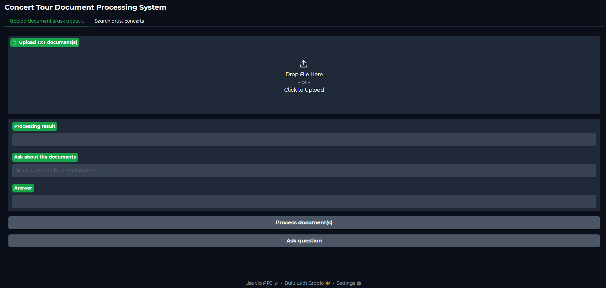
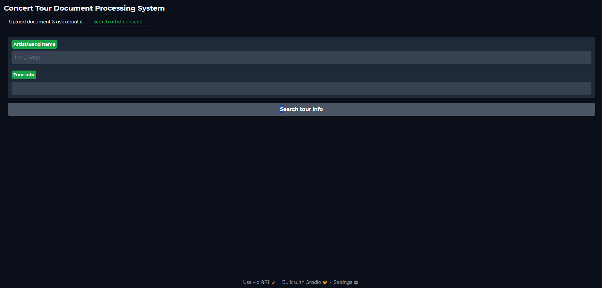

# Provectus Internship - Katarzyna Michalska

## Installation and Setup Instructions

### 1. Install Ollama

Start by installing Ollama by running the following command in your terminal:

```bash
curl -fsSL https://ollama.com/install.sh | sh
```

Once the installation is complete, pull the llama3 model:

```bash
ollama pull llama3
```
### 2. Creating a Virtual Environment

Create a virtual environment:

```bash
python -m venv venv
```

### 3. Activating the Virtual Environment
Activate the virtual environment by running:


```bash
venv\Scripts\activate
```

### 4. Installing Dependencies
After activating the virtual environment, install the required dependencies by running:

```bash
pip install -r requirements.txt
```

### 5. Running the Project
```bash
python main.py
```

After running the project, a link will be printed in the terminal, such as:

```
* Running on local URL: http://127.0.0.1:7860
```

### 6. Proof of concept
[2025-04-15 19-26-52.mkv](..%2F..%2F..%2F..%2FVideos%2F2025-04-15%2019-26-52.mkv)

